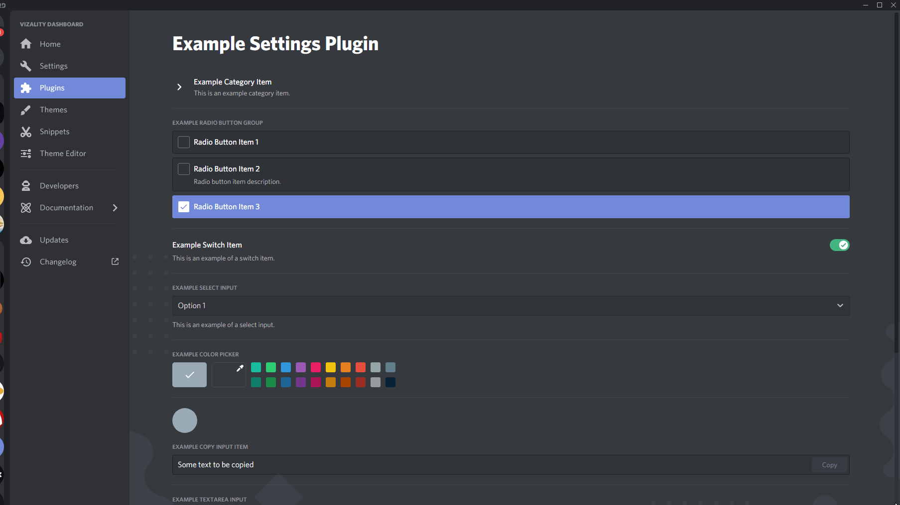

# Example Plugin Settings

A simple demo plugin demonstrating how to use the most common settings components. It shows 2 different ways you could set up your Settings.jsx file, one being as a class component and the other as a functional component, both resulting in the same outcome.

## Preview

## Todo

- [ ] Add RegionSelectInput
- [ ] Add PermissionOverride
